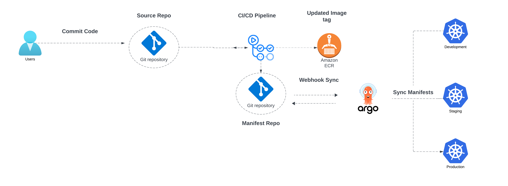

# Enabling GitOps with ArgoCD, Kubernetes, and AWS EKS - Part 2

## GitOps with ArgoCD and GitHub Actions
GitOps with Argo CD and GitHub Actions represents a powerful combination for managing and automating Kubernetes deployments in a cloud-native environment. This approach leverages the strengths of both Argo CD for continuous delivery and GitHub Actions for continuous integration, providing a comprehensive CI/CD pipeline that aligns with GitOps principles.

## Implementation
- Our demo will showcase an application built every time a push is initiated towards the GitHub repository.
- The GitHub Actions workflow will create a new AWS ECR Repo tag and update the Kubernetes object.

## Application Design
- The application is a Flask-based web service with a REST API. It interacts with a DynamoDB table in AWS.
- The application has the following endpoints:
  - `/api/health`: A health check endpoint that returns a status of "OK."
  - `/api/get/<string:item_id>`: An endpoint to retrieve JSON data from the DynamoDB table by ID.
  - `/api/update/<string:item_id>`: An endpoint to update JSON data in the DynamoDB table by ID. It expects JSON data in the request body.
  - `/api/store`: An endpoint to store JSON data in the DynamoDB table. It expects JSON data in the request body.
  - `/api/get-by-email/<string:email>`: An endpoint to retrieve JSON data from the DynamoDB table by customer email.
- The application also includes a helper function, `convert_floats_to_decimals`, to convert float values to decimals, as DynamoDB does not support float types.

## CD/CI GitHub Actions Pipeline
In the pipeline, we will perform multiple steps, allowing us to be minimally involved in the later part of the application development to enforce the changes in the Kubernetes clusters.

### Steps
1. Checkout the repo and log in to Amazon ECR.
2. Build and push the Docker image.
3. Update `deployment.yaml`: Update the deployment object. The YAML file will use the newly built Docker image by replacing the existing image reference with the new one.
4. Configure Git and Create a PR request for merging the updated changes.

## References
- [ArgoCD Documentation](https://argo-cd.readthedocs.io/en/stable/)
- [End-to-End CI/CD DevOps with Jenkins, Docker, Kubernetes, ArgoCD, GitHub Actions](https://medium.com/django-unleashed/technical-guide-end-to-end-ci-cd-devops-with-jenkins-docker-kubernetes-argocd-github-actions-fee466fe949e)